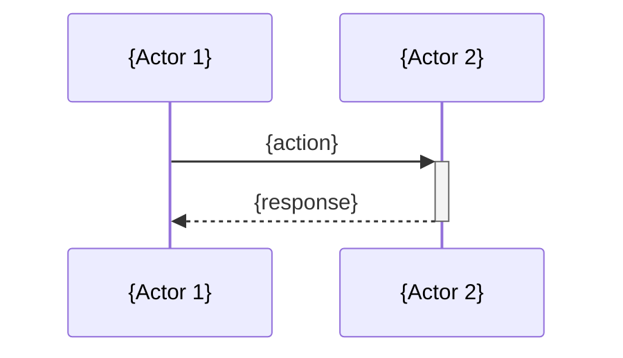

# Doc Templates & Mermaid Conventions

Reference file for the `update-docs` skill. Load this when generating or updating documentation files.

---

## CLAUDE.md Template

Dense, scannable agent reference. 50–200 lines. Link to CODEBASE_MAP.md for full architecture.

```markdown
# {Project Name}

{One-sentence description}

## Stack
- **Language:** {language/version}
- **Framework:** {framework}
- **Database:** {if applicable}
- **Hosting:** {if applicable}

## Quick Commands
```bash
{dev/build/test/lint commands — only those that actually exist}
```

## Structure
```
{Annotated directory tree — top 2 levels, key files only}
```

## Key Patterns
- {Pattern 1: e.g., "All API routes validate input with zod schemas in lib/validators/"}
- {Pattern 2: e.g., "State management uses React context in providers/"}
- {Pattern 3}

## Critical Constraints
- {Constraint 1: e.g., "Never import from internal/ outside the core module"}
- {Constraint 2: e.g., "All DB migrations must be backwards-compatible"}

## Environment Variables
| Variable | Purpose | Required |
|----------|---------|----------|
| {VAR} | {what it does} | {yes/no} |

## Architecture
See [docs/CODEBASE_MAP.md](docs/CODEBASE_MAP.md) for full architecture, data flow, and navigation guide.
```

**Adapt for project type:**
- Shell/CLI projects: drop Database, Hosting, Environment Variables sections
- Libraries: add "Public API" section listing exported functions
- Monorepos: add "Packages" section with package names and purposes

---

## README.md Template

User-facing, narrative, progressive disclosure. Respect existing README structure when updating.

```markdown
# {Project Name}

{2-3 sentence description of what this project does and who it's for}

## Getting Started

### Prerequisites
- {prerequisite 1}
- {prerequisite 2}

### Installation
```bash
{installation commands}
```

### Usage
```bash
{basic usage example}
```

## Project Structure
```
{High-level directory tree — top 1-2 levels}
```

## Architecture
For detailed architecture documentation, see [docs/CODEBASE_MAP.md](docs/CODEBASE_MAP.md).

## Contributing
{If applicable}

## License
{License type}
```

**When updating an existing README:**
- Do NOT restructure sections the user has customized
- Do NOT add sections that don't exist unless they're essential (e.g., missing "Getting Started")
- Update stale content (wrong commands, outdated structure trees, incorrect descriptions)
- Preserve badges, custom sections, and formatting choices

---

## CODEBASE_MAP.md Template

Full architecture map. Lives at `docs/CODEBASE_MAP.md`. This is the primary reference for agents working in the codebase.

```markdown
---
last_mapped: {ISO 8601 timestamp from `date -u`}
total_files: {from scan results}
total_tokens: {from scan results}
---

# {Project Name} — Codebase Map

## Overview

{2-3 sentence summary of what the codebase does, its architecture style, and primary language}

```mermaid
flowchart TB
    subgraph {Layer/Module 1}
        {nodes}
    end
    subgraph {Layer/Module 2}
        {nodes}
    end
    {connections between nodes}
```

## Directory Structure

```
{Full annotated directory tree from scan results}
{Use comments to explain non-obvious directories}
```

## Module Guide

### {Module/Directory Name}

**Purpose:** {What this module does}
**Entry point:** `{main file}`

| File | Purpose | Key exports |
|------|---------|-------------|
| `{file}` | {what it does} | `{exported names}` |

{Repeat for each significant module}

## Data Flow



{Add sequence diagrams for key flows: request handling, data processing, auth, etc.}

## Conventions

- **Naming:** {file naming, variable naming patterns}
- **Error handling:** {how errors are handled}
- **Configuration:** {where config lives, how it's loaded}
- **Testing:** {test file location, naming convention, how to run}

## Navigation Guide

> These are the most actionable entries for agents working in this codebase.

- **To add a new {feature type}:** touch `{file1}`, `{file2}`, `{file3}`
- **To modify {behavior}:** start at `{entry point}`, follow to `{handler}`
- **To add a new {data type}:** create `{file}`, register in `{registry}`, add tests in `{test dir}`
- **To debug {common issue}:** check `{file}` for `{pattern}`, logs are in `{location}`
```

**Navigation guide is mandatory.** It's the most valuable section for agents. Include at least 4 entries covering: adding features, modifying behavior, adding data types, and debugging.

---

## AGENTS.md Template

Deep reference for multi-module projects. Only generate for projects with 4+ distinct modules.

```markdown
# {Project Name} — Agent Reference

## Module Index

| Module | Path | Purpose | Entry Point |
|--------|------|---------|-------------|
| {name} | `{path}` | {purpose} | `{file}` |

## {Module Name}

### Public API
| Function/Class | File | Description |
|----------------|------|-------------|
| `{name}` | `{file}` | {what it does} |

### Internal Patterns
- {Pattern: e.g., "Uses repository pattern — all DB access through repo classes"}
- {Pattern: e.g., "Events are published via EventBus, consumed by handlers in /handlers"}

### Gotchas
- {Gotcha: e.g., "Cache invalidation must happen in the service layer, not the controller"}

{Repeat for each module}
```

---

## Mermaid Conventions

### Diagram Types
| Use case | Diagram type | Direction |
|----------|-------------|-----------|
| System architecture / module relationships | `flowchart TB` | Top to bottom |
| Request pipelines / data flow | `flowchart LR` | Left to right |
| Key interaction sequences | `sequenceDiagram` | N/A |

### Syntax Rules
- **Node IDs:** alphanumeric and underscores only (e.g., `auth_service`, `db_pool`)
- **Arrow labels:** use pipe delimiters (e.g., `-->|handles auth|`). No quotes needed inside pipes.
- **Subgraphs:** group by module or architectural layer, always close with `end`
- **Max 20 nodes per diagram.** Split into multiple diagrams if larger.
- **Keep labels short.** Node labels under 30 chars. Arrow labels under 20 chars.

### Anti-patterns — Do NOT:
- Use mermaid for simple lists (use markdown lists instead)
- Add custom CSS classes or styling
- Use pie charts, gantt charts, or other non-architecture diagram types
- Create diagrams with fewer than 3 nodes (just describe it in text)
- Use special characters in node IDs (`-`, `.`, `/` will break rendering)
